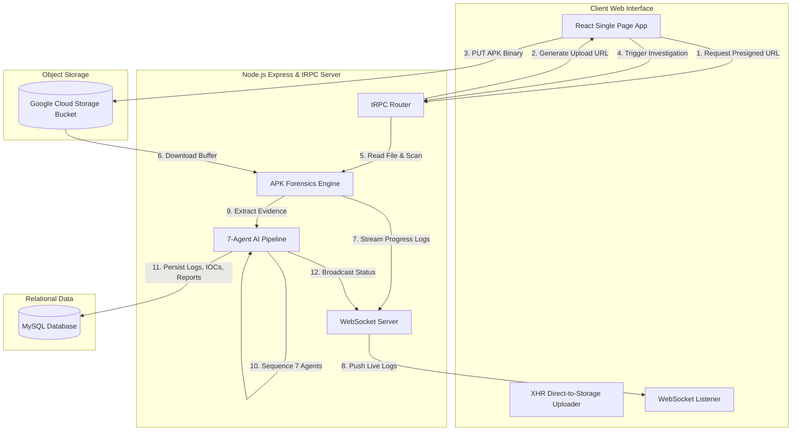

# TRINETRA AI — Full-Stack Cyber Defense Platform

TRINETRA AI is an autonomous, production-grade cybersecurity web application designed to reverse engineer, decompile, scan, and investigate Android Application Packages (APKs) for malware, suspicious activities, and fraud indicators using a 7-agent sequential AI reasoning pipeline.

---

## 📋 Table of Contents
1. [Problem Statement](#-problem-statement)
2. [The Solution](#-the-solution)
3. [Architecture & System Flow](#-architecture--system-flow)
4. [Tech Stack Deep-Dive](#-tech-stack-deep-dive)
5. [Completed vs. Pending Features](#-completed-vs-pending-features)
6. [Advantages & Platform Hardening](#-advantages--platform-hardening)
7. [Future Enhancements](#-future-enhancements)
8. [Local Development Quick Start](#-local-development-quick-start)

---

## 📌 Problem Statement

In the modern mobile landscape, **Android malware** (specifically banking trojans, spyware, credential harvesters, and ransomware) has grown increasingly sophisticated. Attackers frequently utilize:
* **Accessibility Service Abuse**: Exploiting Android Accessibility APIs to capture keystrokes, intercept screen contents, and bypass multi-factor authentication (MFA).
* **Data Exfiltration**: Stealthily gathering SMS messages (for OTP interception), call logs, contacts, and personal files.
* **Command & Control (C2) Channels**: Hardcoding or obfuscating domain names, IP addresses, or Telegram bot credentials to communicate with control servers.
* **Dynamic Code Loading (DCL)**: Downloading encrypted malicious code at runtime to evade static antivirus detection.

### The Bottleneck
Traditional security analysis of APKs is heavily **manual and time-consuming**, requiring skilled security researchers to manually run reverse-engineering utilities (like APKTool and JADX), inspect thousands of lines of decompiled code, map behaviors against frameworks like MITRE ATT&CK, and write executive reports. This manual bottleneck leaves Security Operations Centers (SOCs) vulnerable and slow to react.

---

## 💡 The Solution

TRINETRA AI automates the entire mobile forensics lifecycle:
1. **Unpacking & Static Analysis**: Unzips and decodes the APK binary to extract raw permissions, services, activities, and decompiled Java code.
2. **Indicator of Compromise (IOC) Harvesting**: Automatically scans the package for embedded URLs, IP addresses, API keys, tokens, and suspicious API invocations.
3. **Sequential Multi-Agent AI Reasoning**: Feeds the raw telemetry into a chain of 7 specialized AI agents that act as a virtual team of reverse engineers, threat analysts, and security managers.
4. **Interactive Security Console**: Displays real-time WebSocket updates, permissions analysis, decompiled code viewers, interactive threat graphs, and an AI-powered SOC Copilot.
5. **Real-time Synchronization**: Uses WebSocket events to stream agent status updates, logs, and findings directly to the user's dashboard without page refreshes.

---

## 🏗️ Architecture & System Flow



---

## 🛠️ Tech Stack Deep-Dive

TRINETRA AI uses a modern, type-safe, production-ready full-stack architecture. Here is how each component works, why it was chosen, and the biological/software concept behind it:

### 1. Frontend & Client Layout
* **React (with Vite)**:
  * *Concept*: A component-based JavaScript library for building user interfaces, paired with a modern, blisteringly fast build tool (Vite) utilizing native ES modules.
  * *How it works*: Divides the user interface into reusable, state-managed components. It maintains a Virtual DOM to compute differences (diffing) and selectively re-render HTML nodes.
  * *How it helps*: Provides an interactive, single-page application (SPA) experience with client-side routing (`wouter`), state management, and real-time tab navigation.
* **Tailwind CSS & shadcn/ui**:
  * *Concept*: Utility-first CSS styling framework combined with copy-pasteable, highly accessible, raw UI primitives built on Radix UI.
  * *How it works*: Replaces traditional stylesheets with inline utility classes that generate optimized CSS at compile time. Component logic is decoupled from styling.
  * *How it helps*: Yields premium cyberpunk aesthetics (dark mode, glassmorphism, glowing neon accents, and smooth grid alignments) while keeping the package size minimal.
* **Framer Motion**:
  * *Concept*: A declarative, production-ready animation library for React.
  * *How it works*: Allows animating React elements by simply changing state variables. It handles layouts transitions and exit animations out-of-the-box.
  * *How it helps*: Creates responsive hover states, smooth page entry slide-ins, and dynamic dashboard telemetry changes that keep the platform feeling fluid and premium.

### 2. Backend & Communication Layer
* **Node.js & Express**:
  * *Concept*: An asynchronous event-driven JavaScript runtime designed to build scalable network applications, running on top of Google's V8 engine.
  * *How it works*: Employs a single-threaded event loop and non-blocking I/O operations to handle thousands of concurrent requests without blocking.
  * *How it helps*: Houses the REST APIs, local storage routers, dev-auth endpoints, and binds both tRPC and WebSockets to the same network port.
* **tRPC (TypeScript Remote Procedure Call)**:
  * *Concept*: End-to-end, zero-boilerplate, type-safe API communication between frontend and backend.
  * *How it works*: Shares TypeScript types (interfaces) directly between the backend router and frontend client. When you update server code, your frontend immediately checks for type issues at compile time.
  * *How it helps*: Prevents runtime API contract mismatches, eliminates manual Swagger/JSON definition maintenance, and enforces strict input validation using `Zod`.
* **WebSockets (`ws` package)**:
  * *Concept*: Full-duplex communication channels over a single TCP connection.
  * *How it works*: Upgrades a standard HTTP connection to a persistent TCP stream. Both client and server can push messages instantly at any time.
  * *How it helps*: Powers the real-time activity log terminal, the progress bars, and the sequential agent status cards during active forensic scans.

### 3. Forensic & Reverse Engineering Core
* **APKTool & JADX**:
  * *Concept*: Industry-standard Android APK reverse engineering utilities.
  * *How it works*: `APKTool` decodes the binary resources (`resources.arsc`) and decompiles the compiled bytecode (`classes.dex`) into readable Smali assembly. `JADX` goes a step further, decompiling Smali assembly back into highly readable Java classes.
  * *How it helps*: Allows the application to explore the internal filesystem structure of the app, retrieve the configuration `AndroidManifest.xml`, identify embedded resources, and read the code.
* **Fallback ADM-ZIP Scanner**:
  * *Concept*: A pure JavaScript ZIP decompression utility.
  * *How it works*: Parses the APK file header directly as a standard ZIP archive and extracts configuration strings and raw files.
  * *How it helps*: Ensures that even if the server is running on a environment without APKTool/JADX installed, the platform safely falls back to extracting permissions and searching for IOCs directly from binary files.

### 4. Database & Relational Persistence
* **MySQL & Drizzle ORM**:
  * *Concept*: A robust, enterprise-grade relational database management system, paired with a lightweight, SQL-like Object Relational Mapper.
  * *How it works*: Stores structured data in relational tables with foreign keys and strict schemas. Drizzle ORM acts as a thin TypeScript wrapper, generating optimized SQL queries and managing migrations (`drizzle-kit`).
  * *How it helps*: Safely persists audit logs, user records, investigations, Indicators of Compromise (IOCs), and chat logs with zero abstraction overhead.

### 5. Cloud Infrastructure (GCP)
* **Google Cloud Run**:
  * *Concept*: Serverless container deployment platform running on Knative.
  * *How it works*: Automatically scales Docker containers from zero up to multiple instances based on incoming traffic.
  * *How it helps*: Hosts the entire Node.js backend server. Scales down to zero instances when idle to minimize costs, and scales up dynamically to handle multiple concurrent APK analysis tasks.
* **Google Cloud Storage (GCS)**:
  * *Concept*: Highly durable, scalable object storage.
  * *How it works*: Stores files as binary blobs grouped under buckets, accessible via signed URLs.
  * *How it helps*: Stores the uploaded APK files safely. The frontend uses presigned URLs to upload directly to GCS, bypassing the 32 MiB server request size limits.

---

## 📈 Completed vs. Pending Features

### ✅ Completed Full-Stack Features
1. **Direct-to-Cloud Uploads**: Integrated presigned upload URLs (GCS in production, local storage in development) utilizing XHR progress bar feedback to bypass Cloud Run’s 32 MiB body limit.
2. **Unified Core Server**: Configured Express to serve both tRPC requests, REST files, and a WebSocket server (`/api/ws`) under a single port.
3. **Double Authentication Layer**: Integrates Firebase Authentication (supporting both Google Sign-in and Email/Password credentials) for production and a quick Dev-Auth one-click pathway for local development.
4. **7-Agent Sequential Reasoning Engine**: Fully implemented a chain of 7 agents powered by Gemini:
   * APK structure & Manifest Agent
   * Static Malware Analyzer
   * Dynamic Threat Behavior Predictor
   * Threat Intel Correlator
   * AI Malware Reasoning Engine
   * Fraud Risk Scoring Engine
   * Executive Reporter
5. **Interactive Exploded View**: Explores files, decompiled Smali/Java classes, and configuration assets from within the web interface.
6. **Real-time IOC Analytics**: Automated identification and extraction of URLs, IP addresses, emails, and sensitive API keys, visualized in a high-fidelity interactive map and node network.
7. **SOC Chat Copilot**: An interactive chatbot grounded in the evidence of the active investigation, supporting persistent conversation history.
8. **Exportable Reports**: Enables exporting compiled investigations into clean, downloadable HTML formats and prints to PDF.

### ⏳ Pending Enhancements (Planned Backlog)
1. **Dynamic Sandbox Integration**: Hooking up physical or emulated devices (like MobSF or Frida) to execute APKs and record real-time filesystem, network, and memory activity.
2. **VirusTotal API Enrichment**: Automatically querying SHA256 hashes against VirusTotal databases to fetch immediate global reputation scores.
3. **Multi-File Batch Scanning**: Allowing security teams to drag-and-drop multiple APKs simultaneously for batch analysis queueing.

---

## 🛡️ Advantages & Platform Hardening

* **Bypassing Server Limits (Presigned URLs)**: The direct GCS upload architecture completely resolves the common Cloud Run error (`TypeError: Invalid URL` or `413 Payload Too Large`), ensuring the platform easily processes files up to 150MB.
* **Security Headers & CORS**: Integrated strict CORS controls (allowing cross-origin preflight checks on GCS) and helmet-based security headers.
* **Resource Resiliency**: Integrated automatic fallbacks. If reverse engineering binaries are missing on the host environment, it utilizes a native JS-based zip scanner. If the LLM key is absent during local development, it loads an intelligent mock generator to keep the frontend operational.

---

## 🚀 Future Enhancements

* **CrewAI Multi-Worker Microservices**: Migrating the sequential JS-based agent pipeline to a dedicated Python CrewAI server container, enabling advanced parallel agent interactions.
* **Machine Learning Classification Models**: training local XGBoost or Random Forest models on Permission and Smali code token frequencies to compute static malware signatures with zero API costs.
* **Automated Remediation / IOC Feeds**: Providing REST APIs to export gathered IOCs directly to firewalls, SIEMs, or Intrusion Detection Systems (like Snort or Suricata).

---

## 💻 Local Development Quick Start

### Prerequisites
* Node.js 20+
* Docker Desktop (for MySQL)

### Steps
1. **Clone the repo**:
   ```bash
   git clone https://github.com/SriRamkunamsetty/cyber-defense-platform.git
   cd cyber-defense-platform
   ```
2. **Install modules**:
   ```bash
   npm install
   ```
3. **Configure Environment**:
   ```bash
   copy .env.example .env
   ```
4. **Boot up Database**:
   ```bash
   npm run docker:up
   ```
5. **Apply Schema Migrations**:
   ```bash
   npm run db:push
   ```
6. **Start Dev Server**:
   ```bash
   npm run dev
   ```
7. **Access App**:
   * Open `http://localhost:3000/api/dev/login` to authenticate instantly.
   * Navigate to the Dashboard and begin scanning!
