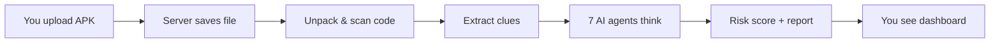
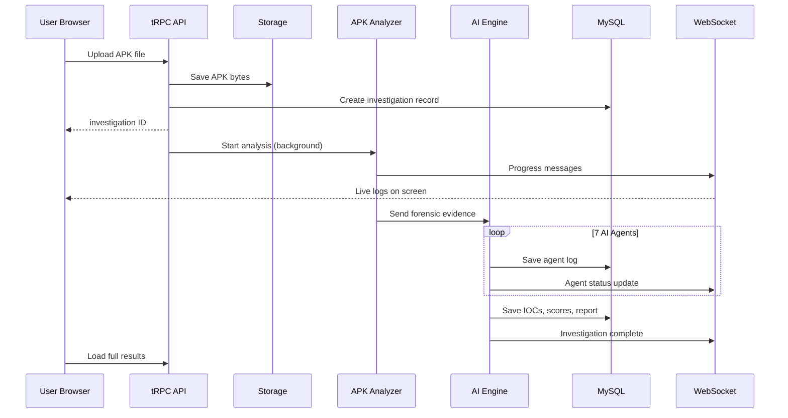
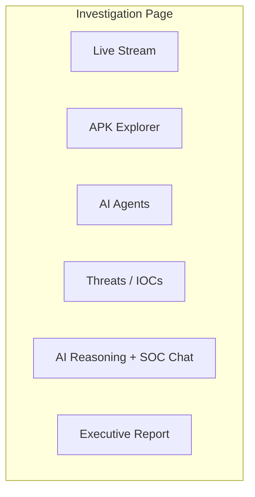
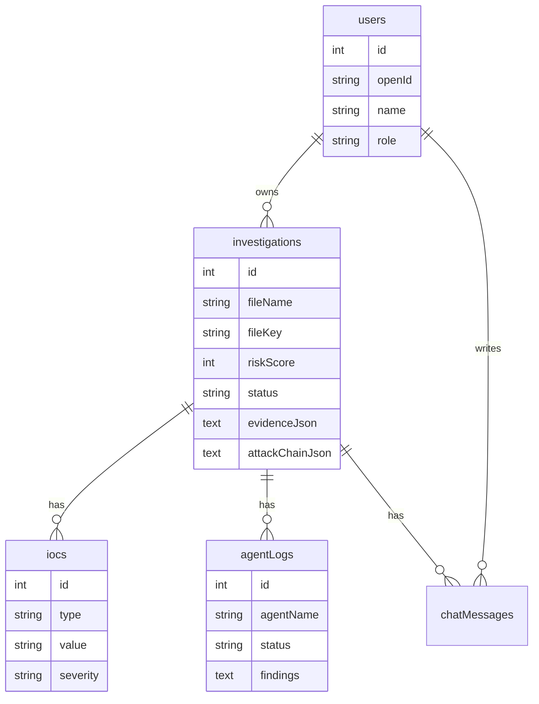
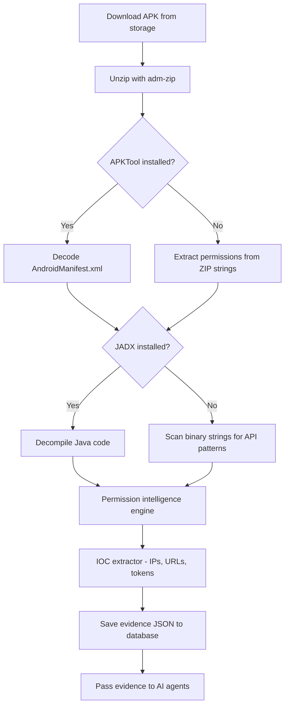
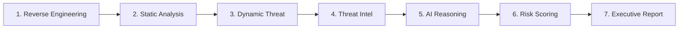

# TRINETRA AI — Complete Project Guide

**For everyone:** This document explains the entire TRINETRA AI project in simple language. If you are in class 10, you can still understand how the app works, what each part does, and how to run it on your computer.

---

## Table of Contents

1. [What is TRINETRA AI?](#1-what-is-trinetra-ai)
2. [The problem it solves](#2-the-problem-it-solves)
3. [How the app works (simple story)](#3-how-the-app-works-simple-story)
4. [Big picture architecture](#4-big-picture-architecture)
5. [Technology stack (tools used)](#5-technology-stack-tools-used)
6. [Project folder structure](#6-project-folder-structure)
7. [Frontend (what you see in the browser)](#7-frontend-what-you-see-in-the-browser)
8. [Backend (the brain on the server)](#8-backend-the-brain-on-the-server)
9. [Database (where data is saved)](#9-database-where-data-is-saved)
10. [APK analysis pipeline (reverse engineering)](#10-apk-analysis-pipeline-reverse-engineering)
11. [AI agents (7 investigators)](#11-ai-agents-7-investigators)
12. [WebSocket (live updates)](#12-websocket-live-updates)
13. [Risk scoring](#13-risk-scoring)
14. [API reference](#14-api-reference)
15. [Local run guide (step by step)](#15-local-run-guide-step-by-step)
16. [Troubleshooting](#16-troubleshooting)
17. [Glossary (difficult words explained)](#17-glossary-difficult-words-explained)

---

## 1. What is TRINETRA AI?

**TRINETRA AI** is a **cybersecurity web application** that helps security experts check **Android APK files** (mobile apps) for **malware** (harmful software).

Think of it like a **digital detective lab**:

- You give it a suspicious app file (`.apk`).
- It **opens** the app like a detective opens a suitcase.
- It **finds clues**: dangerous permissions, bad code, strange websites.
- **AI helpers** explain what the app might do and how dangerous it is.
- You get a **report** with a risk score from 0 to 100.

---

## 2. The problem it solves

| Real-world problem | How TRINETRA helps |
|--------------------|-------------------|
| Banking apps can hide malware | Scans APK before users install |
| Manual analysis is slow | Automates unpacking + AI reasoning |
| Experts need clear reports | Executive report + timeline + IOC list |
| Teams need live progress | WebSocket shows steps in real time |

---

## 3. How the app works (simple story)



**Step by step in plain English:**

1. **Login** — You sign in (local dev uses one-click dev login).
2. **Upload** — You drop an APK on the Dashboard.
3. **Storage** — The server saves the file safely.
4. **Forensics** — Tools unzip the APK and look for dangerous patterns.
5. **AI** — Seven AI “agents” read the clues and write explanations (only based on real evidence).
6. **Live screen** — While working, the app sends live messages to your browser.
7. **Results** — You see risk score, threats, attack chain, and downloadable report.

---

## 4. Big picture architecture

### Block diagram (high level)

```
┌─────────────────────────────────────────────────────────────────┐
│                        YOUR BROWSER                              │
│  ┌─────────────┐  ┌──────────────┐  ┌─────────────────────────┐ │
│  │ Home Page   │  │  Dashboard   │  │ Investigation Workspace │ │
│  │ (marketing) │  │ (upload APK) │  │ (live analysis UI)      │ │
│  └──────┬──────┘  └──────┬───────┘  └───────────┬─────────────┘ │
│         │                │                       │               │
│         └────────────────┼───────────────────────┘               │
│                          │ tRPC + WebSocket                      │
└──────────────────────────┼──────────────────────────────────────┘
                           │
                           ▼
┌─────────────────────────────────────────────────────────────────┐
│                     NODE.JS SERVER (Express)                     │
│  ┌──────────┐  ┌───────────────┐  ┌──────────────────────────┐  │
│  │ tRPC API │  │  WebSocket    │  │  APK Analyzer + AI Engine │  │
│  └────┬─────┘  └───────┬───────┘  └────────────┬─────────────┘  │
│       │                │                        │                │
│       └────────────────┼────────────────────────┘                │
│                        ▼                                         │
│              ┌─────────────────┐    ┌─────────────────┐            │
│              │  MySQL Database │    │  File Storage   │            │
│              └─────────────────┘    └─────────────────┘            │
└─────────────────────────────────────────────────────────────────┘
```

### Detailed flow diagram



---

## 5. Technology stack (tools used)

| Layer | Technology | Simple explanation |
|-------|------------|-------------------|
| Frontend | React + Vite | Builds the web pages you click |
| UI design | Tailwind + shadcn | Makes buttons, cards, colors |
| Animations | Framer Motion | Smooth moving effects |
| API | tRPC | Safe way for frontend to call backend |
| Backend | Node.js + Express | Server that receives requests |
| Database | MySQL | Tables that store investigations |
| Real-time | WebSocket | Push live updates without refresh |
| AI | Gemini (via Forge API) | Large language model for reasoning |
| APK tools | APKTool, JADX (optional) | Professional reverse engineering |
| Fallback | adm-zip (built-in) | Always unpacks APK as ZIP |

> **Note:** The original plan mentioned FastAPI and CrewAI. The **built project** uses **TypeScript/Node** for everything, with **7 sequential AI agents** (similar idea to CrewAI, but in one server).

---

## 6. Project folder structure

```
cyber-defense-platform/
├── client/                 ← Frontend (React pages & components)
│   └── src/
│       ├── pages/          ← Home, Dashboard, Investigation, History
│       ├── components/     ← UI pieces (charts, panels, cards)
│       └── hooks/          ← WebSocket hook, auth hook
├── server/                 ← Backend
│   ├── _core/              ← Server start, auth, LLM, WebSocket mount
│   ├── analysis/           ← APK analyzer + AI engine
│   ├── routers/            ← tRPC investigation routes
│   └── db.ts               ← Database queries
├── drizzle/                ← Database schema & migrations
├── shared/                 ← Types shared by frontend & backend
├── docs/                   ← This guide
├── scripts/                ← Setup helper scripts
├── docker-compose.yml      ← MySQL in Docker
├── .env.example            ← Environment template
└── LOCAL_SETUP.md          ← Short local setup
```

---

## 7. Frontend (what you see in the browser)

### Pages

| Page | URL | What it does |
|------|-----|--------------|
| Home | `/` | Introduces the product |
| Dashboard | `/dashboard` | Upload APK, see stats |
| Investigation | `/investigation/:id` | Live analysis workspace |
| History | `/history` | Past investigations, search & filter |

### Investigation workspace tabs



| Tab | Shows |
|-----|--------|
| **Live** | Real-time log lines + risk gauge |
| **Explorer** | APK file tree, manifest, suspicious code |
| **Agents** | 7 agent cards with status |
| **Threats** | IOC list + threat graph |
| **Reasoning** | AI explanation + chat copilot |
| **Report** | Downloadable executive report |

---

## 8. Backend (the brain on the server)

### Main server file

`server/_core/index.ts` starts:

- Express web server
- WebSocket at `/api/ws`
- tRPC at `/api/trpc`
- Dev login at `/api/dev/login` (local mode)
- Vite dev server for React (development)

### Investigation API (tRPC)

| Procedure | Who can use | What it does |
|-----------|-------------|--------------|
| `investigation.createFromUpload` | Logged-in user | Upload APK, start analysis |
| `investigation.getById` | Owner | Get one investigation |
| `investigation.getWithDetails` | Owner | Investigation + IOCs + agent logs |
| `investigation.listUserInvestigations` | Owner | History list |
| `investigation.getChatHistory` | Owner | SOC chat messages |
| `investigation.addChatMessage` | Owner | Save chat message |
| `investigation.askCopilot` | Owner | Ask AI about this investigation |
| `system.diagnostics` | Everyone | Health check (DB, tools, mode) |
| `system.health` | Everyone | Simple OK check |
| `auth.me` | Everyone | Who am I logged in as? |
| `auth.logout` | Everyone | Log out |

---

## 9. Database (where data is saved)



### Table explanations (simple)

| Table | Stores |
|-------|--------|
| **users** | People who log in |
| **investigations** | Each APK scan job |
| **iocs** | Indicators of compromise (IPs, permissions, etc.) |
| **agentLogs** | What each AI agent found |
| **chatMessages** | SOC copilot conversation |

---

## 10. APK analysis pipeline (reverse engineering)

### Pipeline diagram



### What we look for in an APK

| Clue type | Example | Why it matters |
|-----------|---------|----------------|
| Permission | `READ_SMS` | Can steal OTP messages |
| Permission | `BIND_ACCESSIBILITY_SERVICE` | Banking trojan trick |
| Code pattern | `SmsManager.sendTextMessage` | Sends SMS without user knowing |
| Code pattern | `DexClassLoader` | Loads hidden malicious code |
| Network | Strange URL or IP | Command & control server |
| Token | Telegram bot token | Hidden C2 channel |

---

## 11. AI agents (7 investigators)

Agents run **one after another** (not all at once). Each agent gets:

- **Forensic evidence** (real data from APK scan)
- **Previous agents’ findings**

They must **not invent** fake permissions or URLs.



| # | Agent name | Job |
|---|------------|-----|
| 1 | APK Reverse Engineering | Explain app structure, manifest, components |
| 2 | Static Malware Analysis | Dangerous permissions & code patterns |
| 3 | Dynamic Threat Investigation | Predict runtime behavior from static clues |
| 4 | Threat Intelligence Correlation | Connect IOCs to threat types |
| 5 | AI Malware Reasoning | Full story + attack logic |
| 6 | Risk Scoring | Score 0–100 + 4 categories |
| 7 | Executive Report | Summary for managers |

---

## 12. WebSocket (live updates)

**WebSocket** = a phone line that stays open between browser and server.

### Events you will see

| Event | Meaning |
|-------|---------|
| `agent_progress` | A step message (e.g. “Extracting manifest”) |
| `agent_start` | An AI agent began |
| `agent_complete` | An AI agent finished |
| `investigation_complete` | Whole job done |
| `investigation_error` | Something failed |

### How to connect (technical)

1. Browser opens `ws://localhost:3000/api/ws`
2. Sends: `{ "type": "subscribe", "investigationId": 5 }`
3. Server pushes JSON events until done

---

## 13. Risk scoring

**Risk score:** 0 (safe) to 100 (very dangerous)

| Score | Level | Color meaning |
|-------|-------|---------------|
| 0–39 | Low | Green |
| 40–59 | Medium | Yellow |
| 60–79 | High | Orange |
| 80–100 | Critical | Red + alert modal |

**Four sub-scores:**

1. Data exfiltration (stealing data)
2. Credential harvesting (stealing passwords)
3. C2 communication (talking to hacker servers)
4. Banking trojan indicators (financial fraud)

If score **> 80**, the platform owner gets an alert notification.

---

## 14. API reference

### HTTP routes (non-tRPC)

| Method | Path | Purpose |
|--------|------|---------|
| GET | `/api/dev/login` | Local dev sign-in |
| GET | `/api/oauth/callback` | Production OAuth callback |
| GET | `/api/local-files/*` | Download stored APK (local dev) |
| WS | `/api/ws` | WebSocket |

### Environment variables

See `.env.example`. Important ones:

| Variable | Required | Purpose |
|----------|----------|---------|
| `LOCAL_DEV` | For local | Enables dev login + local file storage |
| `DATABASE_URL` | Yes | MySQL connection string |
| `JWT_SECRET` | Yes | Session cookie security |
| `BUILT_IN_FORGE_API_KEY` | Optional locally | Real Gemini AI (else mock) |
| `PORT` | No | Default 3000 |

---

## 15. Local run guide (step by step)

### What you need installed

1. **Node.js 20+** — [https://nodejs.org](https://nodejs.org)
2. **Docker Desktop** — for MySQL ([https://www.docker.com/products/docker-desktop](https://www.docker.com/products/docker-desktop))
3. **Optional:** APKTool and JADX on PATH (deeper analysis)

### Step 1 — Get the code

```bash
git clone https://github.com/SriRamkunamsetty/cyber-defense-platform.git
cd cyber-defense-platform
```

### Step 2 — Install packages

```bash
npm install
```

> If install fails, the project includes `.npmrc` with `legacy-peer-deps=true`.

### Step 3 — Environment file

```bash
copy .env.example .env
```

Edit `.env` if needed. Default MySQL password is `trinetra`.

### Step 4 — Start MySQL (Docker)

**Start Docker Desktop first**, then:

```bash
npm run docker:up
```

Wait until healthy:

```bash
docker compose ps
```

### Step 5 — Database tables

```bash
npm run db:push
```

### Step 6 — Check tools (optional)

```bash
npm run tools:check
```

### Step 7 — Start the app

```bash
npm run dev
```

Wait for:

```
Server running on http://localhost:3000/
Dev login: http://localhost:3000/api/dev/login
```

### Step 8 — Use the app

| Step | Action |
|------|--------|
| 1 | Open **http://localhost:3000/api/dev/login** |
| 2 | Go to **Dashboard** |
| 3 | Upload a `.apk` file |
| 4 | Watch **Investigation** page update live |
| 5 | Check **History** for past runs |

### Quick command cheat sheet

```bash
npm run dev          # Start app
npm run docker:up    # Start MySQL
npm run docker:down  # Stop MySQL
npm run db:push      # Run migrations
npm test             # Run tests
npm run tools:check  # Check apktool/jadx
```

---

## 16. Troubleshooting

| Problem | Solution |
|---------|----------|
| **Connection Failed** in browser | Run `npm run dev`. Check terminal for port (3000 or 3001). |
| Port 3000 busy | `netstat -ano \| findstr :3000` then `taskkill /PID <id> /F` |
| Docker error “pipe not found” | Open **Docker Desktop** and wait until running |
| Login fails / 500 error | MySQL not running → `npm run docker:up` and `npm run db:push` |
| Upload says unauthorized | Visit `/api/dev/login` first |
| Few permissions found | Install APKTool and JADX, add to PATH |
| AI seems generic | Set `BUILT_IN_FORGE_API_KEY` in `.env` |

---

## 17. Glossary (difficult words explained)

| Word | Simple meaning |
|------|----------------|
| **APK** | Android app package file (like a .zip of an app) |
| **Malware** | Harmful software |
| **IOC** | Indicator of Compromise — a clue (IP, permission, URL) |
| **Reverse engineering** | Opening software to see how it works inside |
| **Manifest** | App’s config file (permissions, activities) |
| **WebSocket** | Live connection for instant updates |
| **tRPC** | Type-safe API between frontend and backend |
| **Agent** | An AI worker with one specific job |
| **SOC** | Security Operations Center — team that fights hackers |
| **C2** | Command and Control — hacker’s remote server |
| **JWT** | Secure login cookie technology |
| **Forensics** | Collecting digital evidence carefully |

---

## Project team & license

- **Project name:** TRINETRA AI / Cyber Defense Platform  
- **Repository:** cyber-defense-platform  
- **License:** MIT  

For a shorter setup guide, see [LOCAL_SETUP.md](../LOCAL_SETUP.md).

---

*Document version: 1.0 — matches codebase commit with real APK pipeline, local dev, and full UI integration.*
